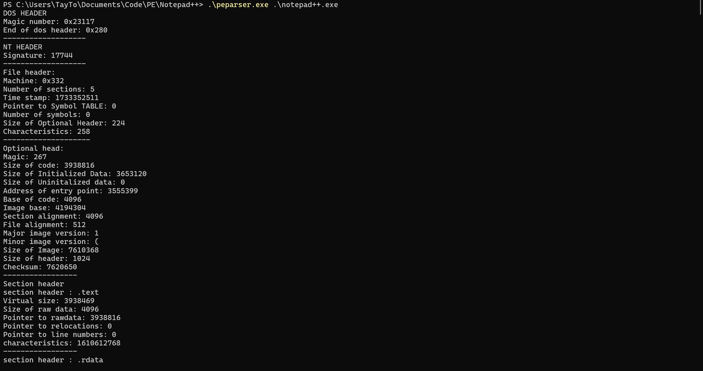
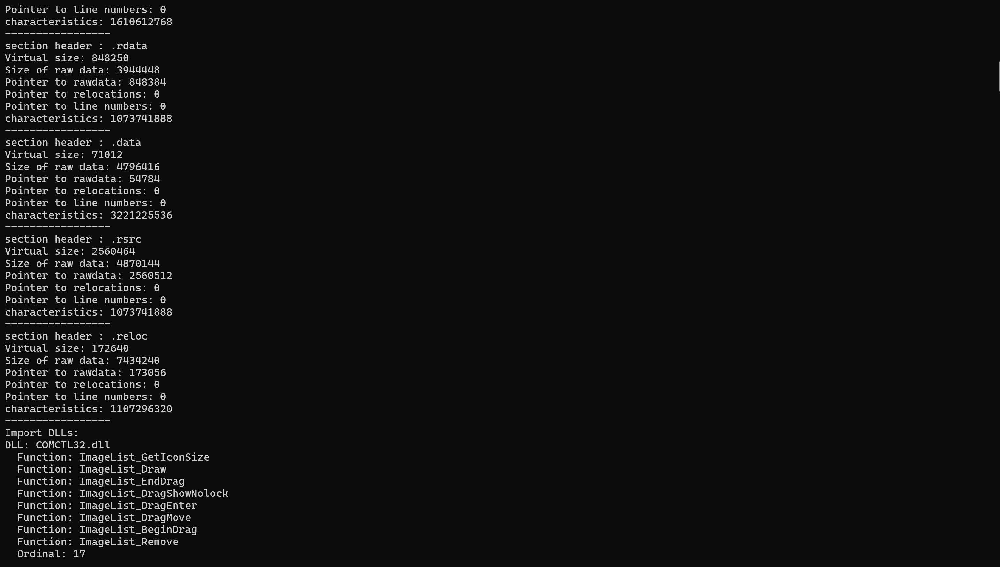
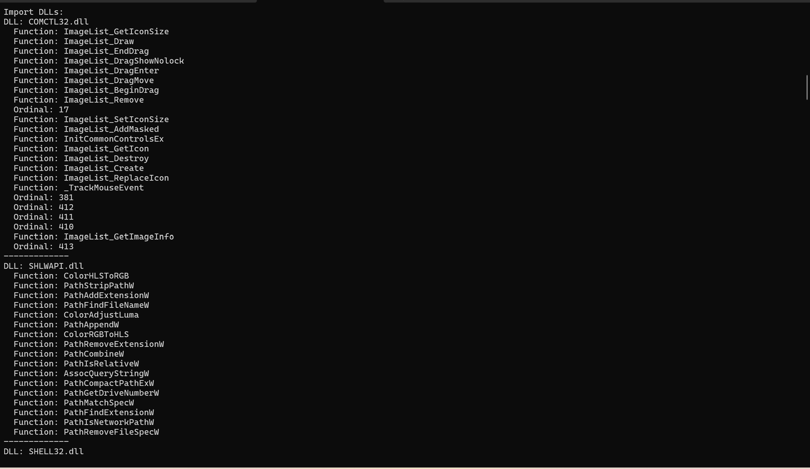
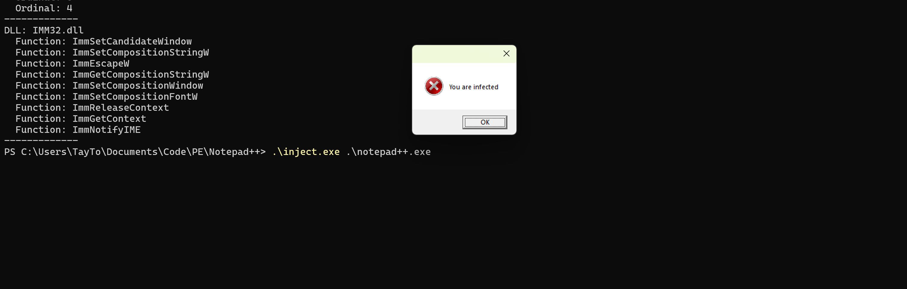
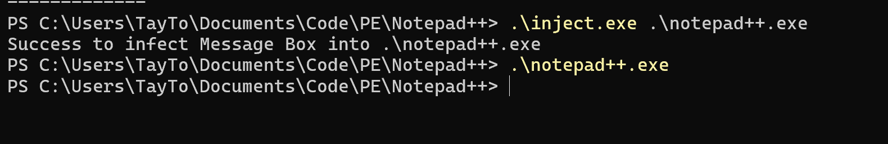
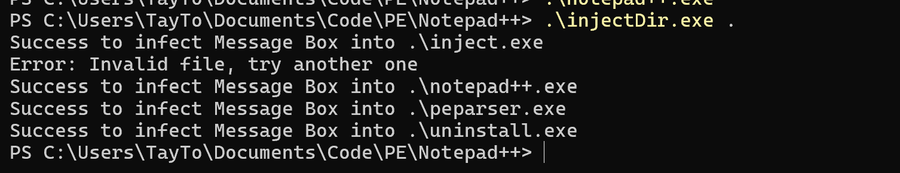
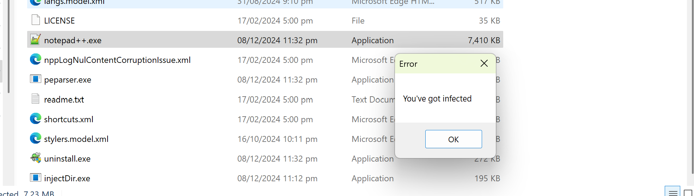
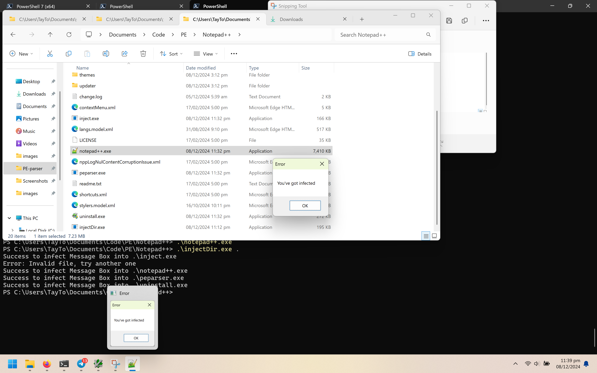

# Pefile Injection.
**P/s: The notepad++ sample is notepad++ 32 bit, program in this repo will not manipulate 64bit app**
## Pefile parser (In the folder Parser).
This file will extract all the fields in the PE header of a PE file.
Run tool using : `peparser.exe filepath`.
Here are some results:
> Resutl:
> 
> 
> 

## Message box injection (In the MessageBoxInject).
The program will inject a message box to a PE file.
Run the program using the following cmd: `inject.exe filepath` .
> Result:
> 
> 

## Inject using a masm shell (In the InjectAllDirectory).
- The program will inject a shell code to another pe file, this shell code can load windows api for it self and it will infect the whole folder.
- Run the following command: `injectDir.exe .`
**Note that "." mean the whole folder**
> Result:
> 
When try to run notepad++.exe, it will display message box
> 
> 
Message box when open peparser.exe
> 

## Inject and run normally (In the folder InjectAndRunNormally)
- Run command `infected.exe fileName`
This program will inject a messageBox to a PEfile and after quit the messageBox, the infected pe file will run normally.

